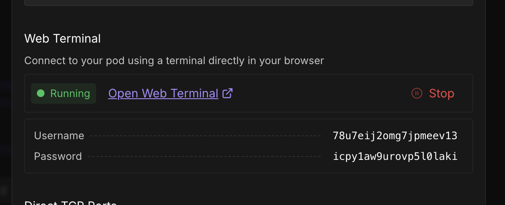
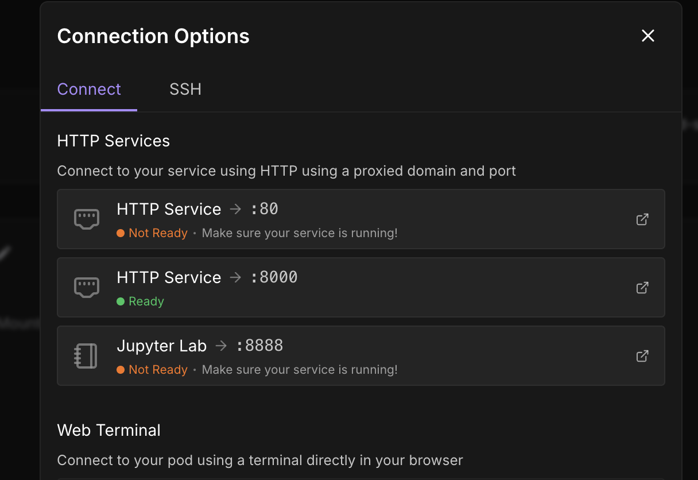
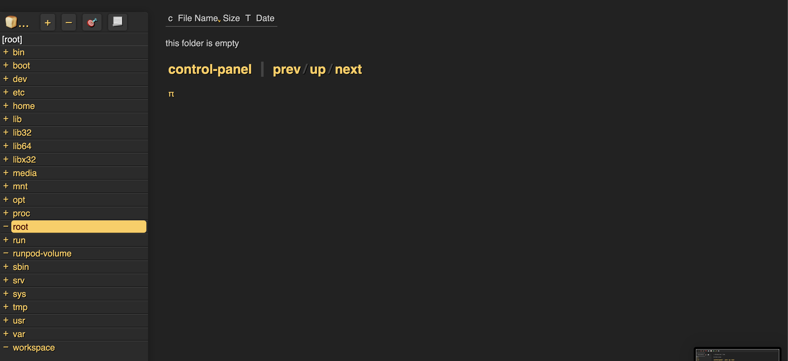
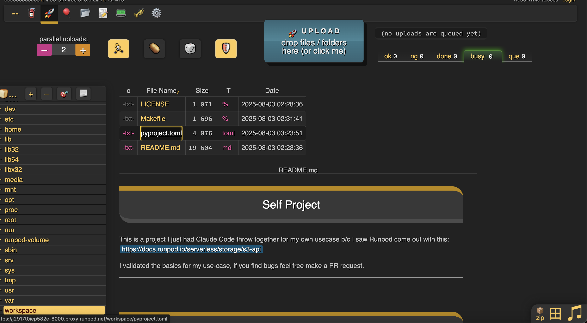
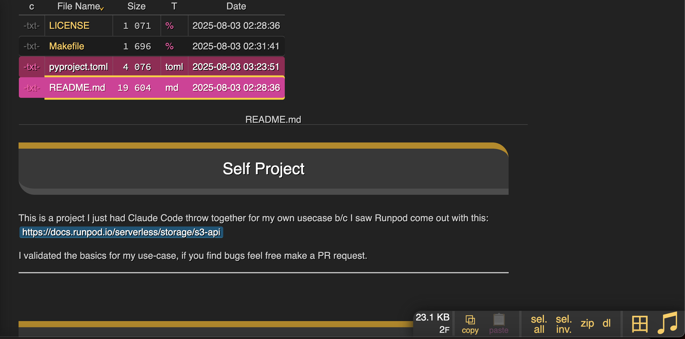

# Youtube Video from the Creator of the CopyParty Project
https://github.com/9001/copyparty
https://youtu.be/15_-hgsX2V0?si=AXArKvI79LEscpNn


# How to Get a UI on Runpod

**YOU MUST BE ABLE TO ACCESS A TERMINAL ON YOUR POD** to do this. Web terminal or a terminal in jupyter notebook, or however you do it.

You know if you have access to the web terminal if you see this when you click "Connect" on your pod page.



1. Go to your Pod Page


2. Add a new HTTP port
**DOING THIS WILL RESTART THE SERVER AND WIPE ANYTHING NOT IN THE /workspace` folder**

> If you have any files that did not come with your docker container by default or installed any libraries **IT WILL BE ERASED** when you add a PORT b/c it restarts your pod.

You need to have an HTTP port that is free. If you already have a port that does not have something running on it you can skip this step.

So if you have something running on 8888, then add a port 8000, so on.
We need a dedicated port for the GUI.

In this case I add a port 8000.


3. In the terminal you need to run a command, change the `-p 8000` depending on the port you want.

If your pod has web terminal installed it is somewhere you can do it. Or you can do it in your jupyter notebook terminal if you have it installed. 


###Option 1:
```
curl -LsSf https://astral.sh/uv/install.sh | sh && source $HOME/.local/bin/env && uv tool run copyparty -p 8000 --allow-csrf
```

###Option 2:
If you want to run it in the background even if you close the tab, you can install a library called tmux to do so. So that even if your tab is closed it will keep working:
Only if you want to be able to close the tab by using tmux to keep a session going even if your web terminal or normal terminal is closed:
```
apt-get update && apt-get install tmux -y && tmux new-session -d -s copyparty 'curl -LsSf https://astral.sh/uv/install.sh | sh && source $HOME/.local/bin/env && uv tool run copyparty -p 8000 --allow-csrf' && tmux attach -t copyparty
```

4. You can now go to Runpod and click the port that you launched on


5. You can now see your directory on the left side


6. You can drag and drop files you want to upload

7. Or you download by clicking them, turning them into pink highlights and on the bottom right click "dl" to download them individually or "zip" to download it as a zip


